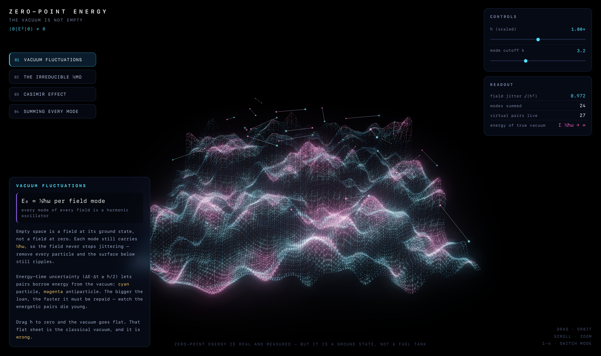
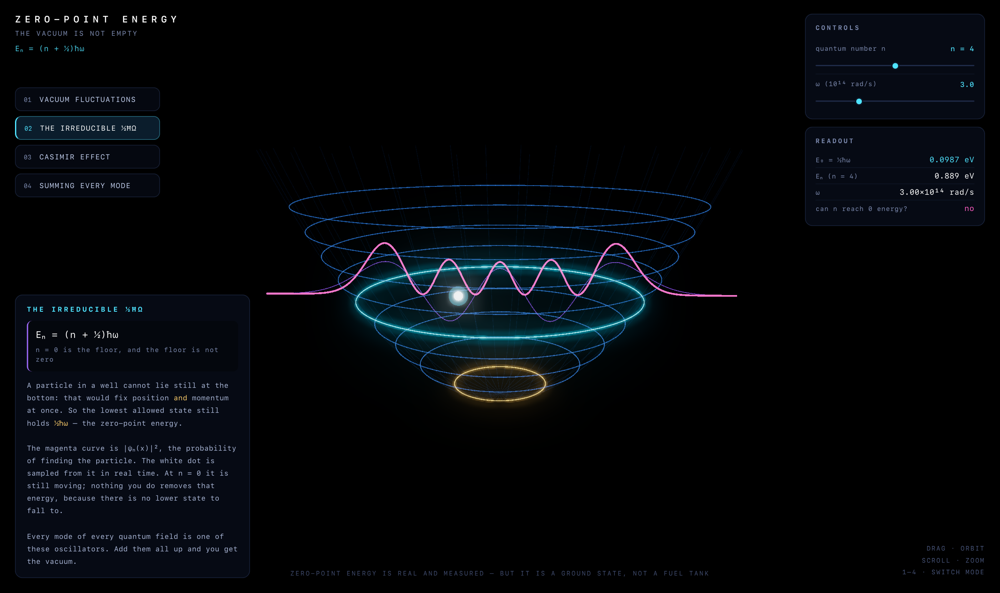
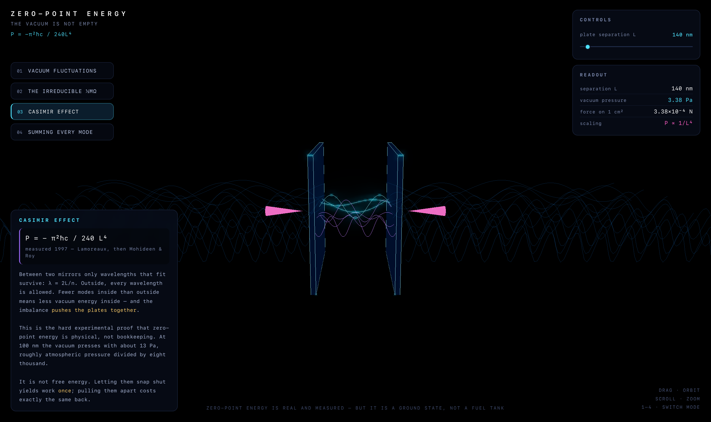
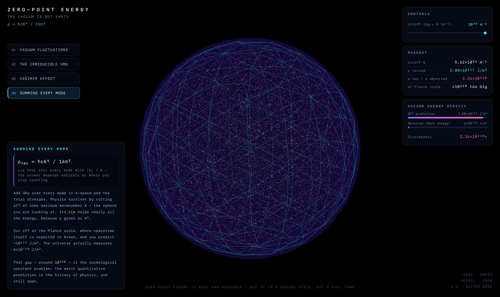

<div align="center">

# ⚛️ Zero-Point Energy

**An interactive Three.js tour of the quantum vacuum — vacuum fluctuations, the irreducible ½ħω, the Casimir effect, and the worst prediction in physics**

[](https://threejs.org)
[](https://developer.mozilla.org/en-US/docs/Web/API/WebGL_API)
[](https://developer.mozilla.org/en-US/docs/Web/HTML)
[](#-getting-started)
[](#-license)

[Screenshots](#-screenshots) · [The Four Modes](#-the-four-modes) · [Getting Started](#-getting-started) · [The Physics](#-the-physics) · [Tech Stack](#️-tech-stack)

</div>

---

## 📸 Screenshots

| Vacuum Fluctuations | The Irreducible ½ħω |
|:-:|:-:|
|  |  |

| Casimir Effect | Summing Every Mode |
|:-:|:-:|
|  |  |

## ✨ Features

- **Four Physics Scenes** — Each one builds on the last, from a jittering field to the cosmological constant problem
- **Real Equations, Live** — Every readout is computed from SI constants, not faked; 100 nm plates really do read 13 Pa
- **GPU Field Synthesis** — 24 field modes summed per-vertex in GLSL across 22,500 points, so the vacuum surface runs at 120 fps
- **Turn Off ħ** — Drag Planck's constant to zero and watch the vacuum flatten into the classical one. It is the whole argument in one slider
- **Genuine Wavefunctions** — |ψₙ(x)|² built from the Hermite recurrence, with a particle rejection-sampled from that density in real time
- **Casimir Mode Counting** — Only λ = 2L/n survives between the plates; the continuum outside stays dense, and the pressure arrows scale with the imbalance
- **The 10¹²⁰ Problem** — Sweep the cutoff to the Planck scale and watch the predicted vacuum energy pull 120 orders of magnitude away from the measured one
- **No Dependencies** — One HTML file. Three.js loads from a CDN import map; no npm, no bundler, no build step

## 🚀 Getting Started

### Run Locally

```bash
git clone https://github.com/markksantos/zero-point.git
cd zero-point
python3 -m http.server 4242
```

Then open <http://localhost:4242>.

A local server is recommended because the page uses ES module import maps. Opening `index.html` straight from disk works in most modern browsers too.

### Controls

| Input | Action |
|-------|--------|
| `1` – `4` | Switch between the four modes |
| Drag | Orbit the camera |
| Scroll | Zoom |
| Sliders | Drive the physics — each mode exposes its own parameters |

## 🔬 The Four Modes

### 01 · Vacuum Fluctuations

A quantum field surface built from 24 modes, each with the zero-point amplitude √(ħ/2ω), evaluated in the vertex shader. Above it, virtual particle–antiparticle pairs borrow energy from the vacuum and pay it back on a deadline set by ΔE·Δt ≳ ħ/2 — so the most energetic pairs visibly die youngest. The **ħ** slider scales the whole thing; at zero, the surface goes flat and the pairs stop existing. That flat sheet is the classical vacuum.

### 02 · The Irreducible ½ħω

The harmonic oscillator ladder, Eₙ = (n + ½)ħω, drawn as rings at the classical turning points ξ = √(2n+1). The magenta curve is |ψₙ(x)|², computed from the physicists' Hermite recurrence; the white dot is rejection-sampled from that probability density several times a second. At n = 0 it is still moving — there is no lower state to fall into. E₀ is reported in eV against the ω slider.

### 03 · Casimir Effect

Two mirrors in a sea of field modes. Between them only wavelengths that fit survive (λ = 2L/n); outside, every wavelength is allowed. Fewer modes inside than outside means less vacuum energy inside, and the imbalance pushes the plates together with

```
P = − π²ħc / 240 L⁴
```

At 100 nm that is about 13 Pa. At 50 nm it is 208 Pa. Measured in 1997 by Lamoreaux, then by Mohideen and Roy — this is the hard experimental evidence that zero-point energy is physical.

### 04 · Summing Every Mode

Add ½ħω over every mode in k-space and the sum diverges, so you cut it off at some maximum wavenumber K — the sphere on screen. Nearly all the energy lives in the rim, because

```
ρ_vac = ∫₀ᴷ ½ħck · d³k/(2π)³ = ħcK⁴ / 16π²
```

Push the cutoff to the Planck scale and the prediction lands near 10¹¹¹ J/m³. The universe measures 6×10⁻¹⁰ J/m³. The gap — roughly 10¹²⁰ — is the cosmological constant problem, and it is still open.

## 🧮 The Physics

Everything on screen is computed from SI constants rather than tuned by eye:

| Quantity | Expression | Where |
|----------|-----------|-------|
| Zero-point energy | E₀ = ½ħω | Modes 01, 02 |
| Oscillator spectrum | Eₙ = (n + ½)ħω | Mode 02 |
| Wavefunctions | ψₙ(ξ) ∝ Hₙ(ξ)·e^(−ξ²/2) | Mode 02 |
| Turning point | ξ = √(2n+1) | Mode 02 |
| Casimir pressure | P = −π²ħc / 240L⁴ | Mode 03 |
| Allowed cavity modes | λ = 2L/n | Mode 03 |
| Vacuum energy density | ρ = ħcK⁴ / 16π² | Mode 04 |
| Planck cutoff | K = 1/ℓₚ ≈ 6.2×10³⁴ m⁻¹ | Mode 04 |

Zero-point energy is real and measured. It is also a *ground state* — the floor, not a fuel tank. Letting Casimir plates snap shut yields work exactly once; pulling them apart costs the same back.

## 🛠️ Tech Stack

| Category | Technology |
|----------|------------|
| Rendering | Three.js r169 (WebGL2) |
| Shaders | Custom GLSL vertex/fragment programs |
| Post-processing | EffectComposer, UnrealBloomPass, OutputPass |
| Geometry | Line2 / LineMaterial fat lines, instanced point clouds |
| Markup | HTML5, CSS3 |
| Logic | Vanilla JavaScript (ES modules) |
| Dependencies | Three.js via CDN import map — nothing installed |
| Build Step | None |

## 📁 Project Structure

```text
zero-point/
├── index.html                            # Entire app — scenes, shaders, physics, UI
├── screenshots/
│   ├── vacuum-fluctuations.png
│   ├── harmonic-oscillator.png
│   ├── casimir-effect.png
│   └── mode-sum.png
├── README.md
└── LICENSE
```

## 📄 License

MIT License © 2026 Mark Santos
